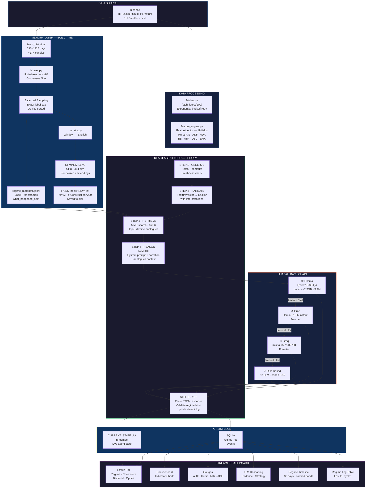

# LLM-Powered Market Regime Detection Agent

> Autonomous BTC/USDT perpetual futures regime classifier combining classical quant indicators, FAISS HNSW vector memory, and a locally-running LLM in a ReAct agent loop — with explainable reasoning on every signal.

---

## What This Is

Most regime detection systems are black boxes — they output a label with no explanation. This system is different. At every hourly candle close, a ReAct agent observes live market data, retrieves historically similar market conditions from a vector memory, and asks a local LLM to reason across both before committing to a regime call. The result is a regime label, a confidence score, and a plain-English explanation of *why* — traceable to specific indicator values and historical analogues.

**Stack:** Python · ccxt · pandas-ta · statsmodels · hmmlearn · FAISS HNSW · sentence-transformers · Ollama (Qwen2.5-3B Q4) · Groq fallback · SQLite · Streamlit · Plotly

---

## Architecture

```
project1_regime_agent/
├── config.yaml                ← all parameters, thresholds, paths — never hardcoded
├── main.py                    ← startup, health checks, APScheduler entry point
│
├── data/
│   ├── fetcher.py             ← ccxt Binance perpetual OHLCV (public endpoints, no auth needed)
│   └── feature_engine.py     ← 19-field FeatureVector dataclass, Hurst R/S from scratch
│
├── memory/
│   ├── labeler.py             ← hybrid HMM + rule-based labeling, consensus filter
│   ├── builder.py             ← balanced index construction, FAISS HNSW, per-label cap
│   └── retriever.py          ← MMR retrieval (relevance + diversity), top-K analogues
│
├── agent/
│   ├── narrator.py            ← FeatureVector → structured natural language narration
│   ├── llm_client.py          ← 4-tier fallback: Ollama → Groq llama → Groq mixtral → rules
│   └── react_loop.py         ← ReAct: Observe → Narrate → Retrieve → Reason → Act
│
├── storage/
│   └── regime_log.py         ← SQLite: regime_log + events tables, all persistence
│
└── dashboard/
    └── app.py                ← Streamlit: live gauges, LLM reasoning, regime timeline
```

---

## System Design

### Architecture Diagram


*(See Mermaid source at the bottom of this file to regenerate)*

---

## Regime Taxonomy

| Regime | Definition | Primary Signals |
|---|---|---|
| `TRENDING` | Sustained directional price movement | ADX > 25, Hurst > 0.58, EMA crossover aligned |
| `MEAN_REVERTING` | Price oscillates around stable mean | Hurst < 0.42, ADF p < 0.05, BB width contracting |
| `HIGH_VOLATILITY` | Elevated realized vol, no conviction | ATR ratio > 1.4x baseline, vol ratio > 1.3x |
| `TRANSITIONAL` | Conflicting signals across regimes | Stored in SQLite, excluded from FAISS, not acted on |

---

## Feature Vector — 19 Fields

Every 1H candle close computes a `FeatureVector` dataclass from the last 200 candles:

**Returns:** `ret_1h`, `ret_4h`, `ret_24h` — log returns over 1, 4, 24 periods

**Trend:** `adx_14`, `di_plus`, `di_minus` via pandas-ta · `ema_9_21_cross` (+1/-1/0) · `price_vs_sma50` as %

**Mean Reversion:** `hurst_exp` via R/S analysis (numpy, no external library) · `adf_pvalue` via statsmodels · `zscore_20` · `bb_width`

**Volatility:** `atr_14` · `atr_ratio` (vs 30-day baseline) · `realized_vol_24h` (annualized) · `vol_ratio` (vs 90-day baseline)

**Volume:** `volume_ratio` (vs 24h mean) · `obv_slope` (linear regression over last 10 candles)

NaN values from insufficient history are filled with expanding rolling mean. All thresholds live in `config.yaml`.

---

## Memory Layer — FAISS HNSW + MMR

### Why HNSW over IVF
At our index size (~50-150 vectors), HNSW gives O(log n) search with no training step required and outperforms IVF on both speed and recall. IVF+PQ pays off at 100K+ vectors — premature optimization here would hurt retrieval quality.

### Hybrid Labeling Pipeline
Historical 1H candles are labeled using two independent methods, then merged:

**Rule-based (primary):** Threshold logic over window-averaged features — ADX/Hurst/EMA for TRENDING, Hurst/ADF/BB for MEAN_REVERTING, ATR ratio/vol ratio for HIGH_VOLATILITY. Signal conflict → TRANSITIONAL.

**Gaussian HMM (validation):** 3-state HMM fitted on `[ret_1h, realized_vol_24h, atr_14]`. States mapped to regime labels by sorting on mean volatility. Cross-validates rule-based output.

**Consensus filter:** Only windows where both methods agree enter FAISS. Disagreements → SQLite only (not retrieved at inference).

### Balanced Index Construction
Raw BTC 2024-2026 data is ~96% TRENDING (bull run). Without balancing, every retrieval returns TRENDING analogues regardless of current conditions. Fix: per-label cap of 50 vectors, sorted by quality proxy (ADX for TRENDING, ADF p-value for MEAN_REVERTING, ATR ratio for HIGH_VOLATILITY), then random shuffle before indexing.

**Observed distribution on 2yr BTC data:** TRENDING: 50 · MEAN_REVERTING: 4 · HIGH_VOLATILITY: 1

The low MR/HV count reflects reality — BTC 2024-2025 was genuinely trending. Extending to 5 years of history (2020 COVID crash, 2022 bear market) increases non-trending window availability significantly.

### MMR Retrieval
Naive nearest-neighbor returns near-duplicate windows (similarity 0.998/0.996 — essentially the same market condition). Maximal Marginal Relevance (MMR) fixes this:

```
MMR score = λ · sim(query, candidate) − (1−λ) · max_sim(candidate, already_selected)
```

`mmr_lambda = 0.6` (config) balances relevance vs diversity. Fetches 5× candidate pool, iteratively selects the best non-redundant match. Each retrieved analogue includes `what_happened_next` — 4H/24H forward returns and regime persistence — so the LLM reasons about outcomes, not just similarity.

---

## ReAct Agent Loop

Runs on APScheduler cron at `:02` past each hour (2 minutes after candle close for settlement).

```
STEP 1  OBSERVE    → fetch_latest(200) from Binance, compute FeatureVector
                     check freshness: skip if latest candle > 90min old

STEP 2  NARRATE    → FeatureVector → structured English (narrator.py)
                     ADX=23.9 → "weak/no trend", Hurst=0.491 → "random walk", etc.

STEP 3  RETRIEVE   → embed narration, MMR search FAISS HNSW
                     returns top-3 analogues with regime label + forward outcomes

STEP 4  REASON     → LLM call with system prompt + narration + analogues
                     output: {regime, confidence, primary_evidence,
                              contradicting_evidence, reasoning, strategy_implication}

STEP 5  ACT        → write to SQLite regime_log
                     update CURRENT_STATE dict (read by dashboard)
                     if regime changed AND confidence > 0.65: write REGIME_CHANGE event
```

---

## LLM Fallback Chain

```
1. Ollama  qwen2.5:3b-instruct-q4_K_M    ← local, ~2.5GB VRAM, primary
2. Groq    llama-3.1-8b-instant           ← free tier, fastest cloud fallback
3. Groq    mixtral-8x7b-32768            ← free tier, stronger reasoning
4. Rule-based only                        ← last resort, confidence capped at 0.55
```

`react_loop.py` calls a single `llm_client.call()` — it never knows which backend fired. Every SQLite row records `backend_used` so you can audit which LLM produced each regime call.

---

## Known Limitations & Design Decisions

**Retrieval bias on trending markets:** BTC 2024-2025 produced only 5 non-TRENDING consensus windows across 2 years. The balanced index cap (50 per label) prevents TRENDING from dominating retrieval, but MR/HV analogues remain sparse. This is a data reality, not a system bug. Extending to 5yr history resolves it.

**LLM anchoring on analogues:** When retrieved analogues are all TRENDING, the LLM tends to call TRENDING even when raw indicators are ambiguous (e.g. ADX=23.9, Hurst=0.49). MMR retrieval and index balancing partially address this, but the fundamental tension between indicator signals and retrieved memory is a known failure mode worth monitoring.

**No ground truth labels:** The hybrid labeling pipeline (rule-based + HMM consensus) is the best available unsupervised approach, but there is no external ground truth to validate against. Regime labeling is inherently subjective.

**Qwen2.5-3B reasoning depth:** A 3B parameter model at Q4 quantization produces coherent but shallow reasoning. Upgrading to Qwen2.5-7B on a higher-VRAM machine or using Groq's mixtral-8x7b as primary would improve reasoning quality significantly.

---

## Quickstart

### Prerequisites
- Python 3.10+
- [Ollama](https://ollama.com/download) installed and running
- Qwen2.5-3B model pulled: `ollama pull qwen2.5:3b-instruct-q4_K_M`
- (Optional) [Groq free API key](https://console.groq.com) for cloud fallback

### Install
```bash
pip install -r requirements.txt
```

### Configure
Edit `config.yaml` — all fields have working defaults. Optionally add:
```yaml
binance:
  api_key: ""       # Read-Only key for higher rate limits (optional)
  api_secret: ""

groq:
  api_key: ""       # Free tier key from console.groq.com (optional)
```

### Run
```bash
# Terminal 1 — agent (builds FAISS index on first run, ~5 min)
python main.py

# Terminal 2 — dashboard
streamlit run dashboard/app.py
```

Dashboard: `http://localhost:8501`

### Rebuild FAISS Index
```bash
python -m memory.builder --rebuild
```

---

## Configuration Reference

All parameters in `config.yaml`. Key fields:

| Section | Key | Default | Description |
|---|---|---|---|
| `binance` | `history_days_memory` | `730` | Days of history for FAISS index build |
| `faiss` | `per_label_cap` | `50` | Max vectors per regime label (balancing) |
| `faiss` | `mmr_lambda` | `0.6` | MMR diversity weight (0=pure diversity, 1=pure relevance) |
| `faiss` | `ef_search` | `50` | HNSW query-time search width (lower = faster, less recall) |
| `labeling` | `window_size` | `100` | Candles per labeled window |
| `labeling` | `window_stride` | `50` | Stride between windows |
| `agent` | `regime_change_min_confidence` | `0.65` | Min confidence to log a REGIME_CHANGE event |
| `ollama` | `timeout_seconds` | `60` | Ollama timeout before falling back to Groq |

---

## SQLite Schema

**`regime_log`** — one row per agent cycle:
`id · timestamp · regime · confidence · primary_evidence · contradicting_evidence · reasoning · strategy_implication · analogues_used · hurst_exp · adx_14 · atr_ratio · adf_pvalue · raw_llm_response · backend_used`

**`events`** — regime change events only:
`id · timestamp · event_type · from_regime · to_regime · confidence · notes`

---

## Dashboard

| Panel | Content |
|---|---|
| Status Bar | Regime badge (color-coded) · Confidence · Last updated · Backend used · Total cycles |
| Confidence Chart | Regime confidence over time with colored regime period backgrounds |
| Indicator Charts | ADX · Hurst×60 · ATR Ratio time series |
| ADX Gauge | 0–60 scale, threshold line at 25 |
| Hurst Gauge | 0–1 scale, colored bands: MR (blue) / random (yellow) / trending (green) |
| LLM Reasoning | Full reasoning text · Primary evidence bullets · Contradicting signals · Strategy implication |
| Regime Timeline | Last 30 days, color-coded regime bands, confidence opacity |
| Regime Log Table | Last 20 cycles with all key fields |

---

## Mermaid Architecture Diagram Source



---

*Built as part of a quantitative research portfolio targeting LLM-augmented trading infrastructure. Project 2 extends this with a multi-agent watchdog framework for live bot monitoring.*